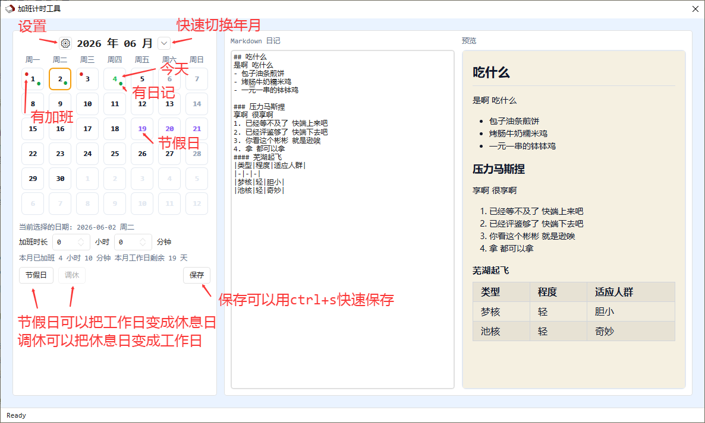
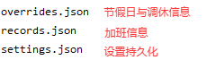

# 加班计时工具

WPF 桌面加班记录与日记应用。

## 功能

### 主页面

### 设置缓存

### 工作日规则

**按周算**: 每n周为一个周期循环 以当前周为第1周
- 假如你是大小周 本周是小周 那么你可以设置成 第一周五天 第二周六天
- 假如你是大小周 本周是大周 那么你可以设置成 第一周六天 第二周五天
- 假如你是逆天的大中小周(61 52 43这样) 本周是中周 那么你可以设置成 第一周五天 第二周四天 第三周六天

**按天算**: 上x休y 今天是轮转的第z天

### 工作日规则

- **按周模式**：设置周期次数（如 1 周、2 周轮换），每周期自定义周一至周日排班
- **按天模式**：设置工作 N 天 + 休息 M 天循环
- 月历根据规则实时显示每天的工作/休息状态

### 颜色与外观

大多数都可以自行diy
- 月历中各种情况下字体的颜色
- 月历上提示点的颜色
- 预览的字体以及背景色
- 窗口的背景色
- 预览的md可以用更细的html配置 有需求可以发issue

### 本地化

- 虽然做了 但是暂时没有实装新增语言包的方式
- 有需求的话发issue 找时间实装一下
